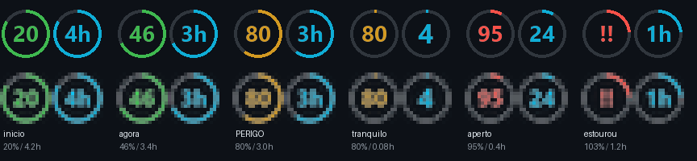
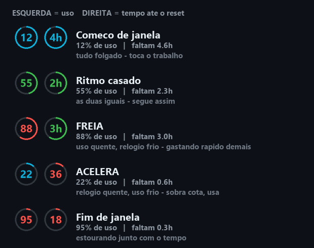

# claude-tray

**O uso da sua janela de 5h do Claude Code, ao vivo na bandeja do sistema.** Dois ícones ao lado do relógio. Sem janela, sem overlay, nada voando na tela.



O ícone da esquerda é **quanto da cota já foi**. O da direita é **quanto da janela já passou**. O que se lê não é nenhum dos dois sozinho — é o **descolamento entre eles**.

*[Read in English](README.md)*

---

## Leia isto primeiro: ele lê o seu arquivo de credenciais

Este programa lê `~/.claude/.credentials.json` — o mesmo token OAuth que o Claude Code guarda. Você deveria desconfiar de qualquer programa que faça isso, inclusive deste. Então aqui está exatamente o que acontece, e são 170 linhas que você mesmo pode ler em [`usage_api.py`](src/claude_tray/usage_api.py):

- **Somente `GET`.** Uma requisição, nenhuma escrita, nenhum efeito colateral na sua conta.
- **Só o `accessToken`**, usado só no header `Authorization`. Nunca logado, nunca copiado, nunca gravado em lugar nenhum.
- **O `refreshToken` nunca é tocado.** Refresh tokens costumam ser rotativos — renovar um por fora poderia derrubar a sessão do próprio Claude Code. Se o access token expirou, o medidor degrada em vez de renovar.
- **Nada sai da sua máquina** além dessa requisição para `api.anthropic.com`. Sem telemetria, sem analytics, sem servidor meu em lugar nenhum.

O token é relido do disco a cada chamada, então ele pega a renovação que o CLI fizer sozinho.

---

## Como ler os dois ícones

Uso sozinho não decide nada: **80% com 3h pela frente e 80% com 5 min são situações opostas.** É por isso que são dois ícones, e não um só mais esperto.

### A mesma escala de cor nos dois

Ambos medem a mesma grandeza — *quanto já foi consumido*. Um consome cota, o outro consome relógio.

| Faixa | Cor | Esquerda (cota gasta) | Direita (janela decorrida) |
|---|---|---|---|
| Folgado | 🔵 azul `#0fadd6` | < 30% | restam mais de 3h30 |
| Tranquilo | 🟢 verde | 30–59% | restam 2h–3h30 |
| Atenção | 🟡 âmbar | 60–84% | restam 45min–2h |
| Crítico | 🔴 vermelho | 85% ou mais | restam menos de 45 min |
| Inativo / leitura velha | ⚪ cinza | — | — |

### O sinal é o descolamento



| Você vê | Significa | Faça |
|---|---|---|
| Esquerda mais quente que a direita | Queimando cota rápido demais para a janela | **Freia** — ou você zera antes do reset |
| Direita mais quente que a esquerda | Sobra cota, falta relógio | **Acelera** — cota não usada evapora no reset |
| As duas na mesma cor | Ritmo casado com a janela | Segue |

> **Vermelho no ícone de tempo não é alarme.** Reset chegando é notícia boa. O que alarma é a *diferença* entre os dois.

Os dois anéis também enchem **no mesmo sentido horário** — o da direita desenha a janela *decorrida*, não a sobra. Um anel que esvazia enquanto o vizinho enche obriga a inverter um deles na cabeça a cada olhada.

Passe o mouse em qualquer um dos dois para o detalhe: hora exata do reset, uso semanal, ritmo atual em %/h, projeção até o fim da janela e a idade da leitura.

---

## Instalação

Requer Python 3.10+ e Windows (veja [suporte a plataformas](#suporte-a-plataformas)).

```bash
uv tool install claude-tray     # ou: pipx install claude-tray
claude-tray                     # sobe agora
claude-tray --autostart         # e em todo logon
```

Pronto. Se os ícones caírem no menu escondido `^`, arraste-os para fora — ou vá em **Configurações → Personalização → Barra de tarefas → Outros ícones da bandeja do sistema** e ligue os dois.

### Outros comandos

```bash
claude-tray --status            # está rodando? o que a janela marca?
claude-tray --config            # abre o config no editor padrão
claude-tray --debug             # roda em primeiro plano, imprimindo cada refresh
claude-tray --remove-autostart  # tira do logon
```

`claude-tray --status --json --offline` devolve o mesmo estado em JSON, sem tocar na rede — é o que o hook do plugin consome.

`claude-trayw` é o mesmo programa sem console — é ele que o autostart registra.

---

## Como plugin do Claude Code

Se você preferir não pensar em subir o medidor:

```
/plugin marketplace add alexmerovic/claude-tray
/plugin install claude-tray
```

Isso adiciona um hook `SessionStart`, que confere o medidor quando uma sessão abre, e um comando `/usage-tray`, que relata o estado atual no chat.

**O hook só fala quando há notícia nova**, e existe exatamente um caso: você instalou o plugin mas não instalou o medidor. Ele nunca lança nada sozinho — abrir uma sessão de terminal não deveria ter efeito colateral fora do terminal, e `claude-tray --autostart` já cobre o "sempre de pé", de forma explícita e uma vez só.

Se você quiser que ele suba o medidor, a mecânica já está no `main()` — troque o `return` de `decidir()` ([`hooks/ensure_tray.py`](hooks/ensure_tray.py)) para `"subir"`. Os trade-offs estão na docstring.

---

## Configuração

Mora em `~/.claude-tray/config.json` (criado no primeiro uso, e nenhum upgrade encosta nele). Clique direito em qualquer ícone → **Reload config** aplica sem reiniciar.

| Chave | O que faz |
|---|---|
| `intervalo_seg` | Cadência de redesenho. O relógio anda localmente e sai de graça. |
| `intervalo_api_seg` | De quanto em quanto tempo o percentual oficial é buscado. Uma requisição cada. |
| `stale_seg` | Acima dessa idade a leitura fica cinza: *"não confio mais neste número"*. |
| `limiares` | Cortes das faixas de cor. Cortes baixos avisam cedo, mas deixam os ícones vivendo em âmbar — e aí viram ruído de fundo; cortes altos mantêm tudo limpo, mas o aviso chega quando já não dá pra reorganizar a janela. |
| `cores` | Hex de cada faixa. |
| `icone.arco` | `false` tira o anel e deixa só o número — mais legível em 16px. |
| `modo_arco` | `uso` (o anel acompanha o próprio número) ou `tempo` (o anel carrega o relógio). |
| `icone_tempo.ativo` | `false` deixa só um ícone. |

---

## De onde vem o número

`GET https://api.anthropic.com/api/oauth/usage` — a mesma rota que o `/usage` do próprio Claude Code usa. Devolve `five_hour.utilization` (o percentual real), `five_hour.resets_at` (o instante exato do reset) e os números da semana.

**Essa rota não é documentada.** Ela pode mudar ou sumir sem aviso. Quando isso acontecer, o medidor degrada em três níveis em vez de mentir para você:

1. **Leitura ao vivo** da API (segundos de idade)
2. **`cachedUsageUtilization`** de `~/.claude.json`, gravado pelo próprio Claude Code — sem rede, mas pode ter horas
3. **Última leitura boa, em cinza** — o número está velho e o ícone diz isso

Uma leitura nova nunca é substituída por uma mais velha, então uma piscada de rede não troca em silêncio um 63% fresco por um 36% de 6h atrás. E como `resets_at` é um instante absoluto, **o relógio continua andando sem rede nenhuma** — conexão caída congela o percentual, nunca a contagem.

### Por que não simplesmente contar tokens?

Uma versão anterior contava: somava os campos `usage` de `~/.claude/projects/**/*.jsonl` e dividia por um limite calibrado à mão. Medido contra a fonte real: a estimativa dizia **26%** quando o `/usage` dizia **62%**.

O limite não estava mal ajustado — **a relação token → percentual não é estável entre janelas**, então nenhuma calibração sobreviveria. Os tokens continuam sendo lidos para os valores absolutos do tooltip (tokens e US$ estimado), porque *esses* são fato. O percentual não é algo que dê para inferir localmente.

---

## Por que bandeja e não "barra de tarefas"

A barra do Windows 11 tem duas regiões, e só uma aceita coisa de terceiro:

| Região | Dá? | Por quê |
|---|---|---|
| Bandeja do sistema (ao lado do relógio) | Sim | `Shell_NotifyIcon` segue viva e suportada |
| Deskband / toolbar (faixa larga com texto) | Não | O Win11 reescreveu a taskbar em XAML e removeu deskbands COM |

Restaurar deskband exige ExplorerPatcher ou StartAllBack — hack de sistema, deliberadamente fora de escopo.

O Windows também não sabe desenhar *texto* na bandeja — só aceita um `HICON`. Então o número é desenhado numa bitmap com Pillow a cada refresh e convertido em ícone. (O pystray chama `DestroyIcon` no handle anterior a cada troca, então não há vazamento de handle GDI — que é o bug clássico desta categoria de app.)

---

## Suporte a plataformas

**Windows** é onde isto foi construído e testado. O pystray suporta macOS e Linux, então o medidor provavelmente roda lá, mas `--autostart` (Task Scheduler) e a busca de fonte são específicos do Windows. PRs com LaunchAgent do macOS ou `.desktop` do Linux são bem-vindos — o `autostart.py` marca exatamente onde entram.

## Notas

Os comentários do código estão em português: eles carregam o raciocínio por trás de cada trade-off. Tudo que o usuário lê — menus, tooltips, mensagens do CLI — está em inglês. As **chaves do `config.json` continuam em português** (`limiares`, `cores`, `modo_arco`), documentadas em inglês nas tabelas acima.

Licença MIT. Sem vínculo com a Anthropic.
